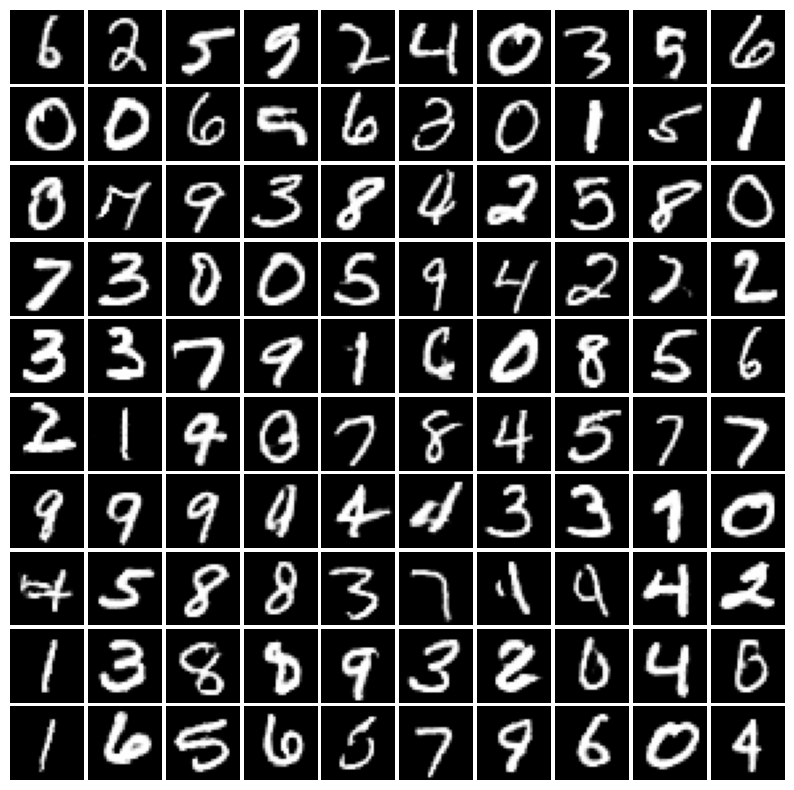
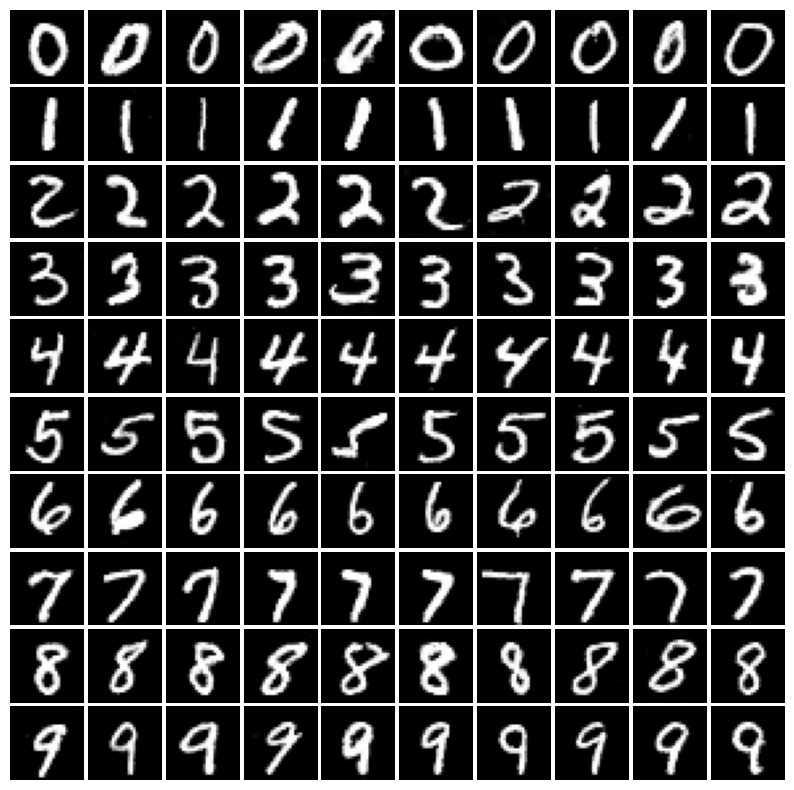
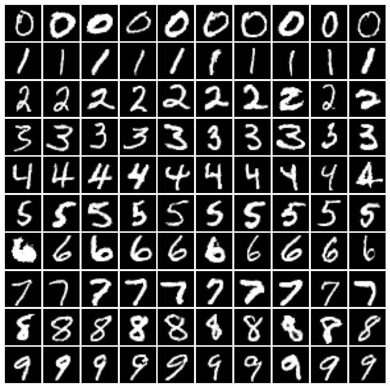

# SAN (simple code)

This repository provides a simple implementation of Slicing Adversarial Network (SAN) on MNIST for a tutorial purpose. (*[arXiv 2301.12811](https://arxiv.org/abs/2301.12811)*).
Please cite [[1](#citation)] in your work when using this code in your experiments.

### [[Project Page]](https://ytakida.github.io/san/)


## Requirements
This repository builds on the codebase of
1. https://github.com/yukara-ikemiya/minimal-san
2. https://github.com/JensRahnfeld/Simple-GAN-MNIST

Install the following dependencies:
- Python 3.8.5
- pytorch 1.6.0
- torchvision 0.7.0
- tqdm 4.50.2

## Training

### 1) Hyperparameters
Specify hyperparameters inside a .json file, e.g.:

```json
{
  "dim_latent": 100,
  "batch_size": 128,
  "learning_rate": 0.001,
  "beta_1": 0.0,
  "beta_2": 0.99,
  "num_epochs": 200
}
```

### 2) Options

```
  -h, --help
    show this help message and exit<br>
  --datadir DATADIR
    path to MNIST dataset folder
  --params PARAMS
    path to hyperparameters
  --model MODEL
    model's name / 'gan' or 'san'
  --enable_class
    enable class conditioning
  --device DEVICE
    gpu device to use
```
</details>

### 3) Train the model

- Class conditional (hinge) SAN
```bash
python train.py --datadir <path_to_mnist> --model 'san' --enable_class
```

- Unconditional (hinge) GAN
```bash
python train.py --datadir <path_to_mnist> --model 'gan' 
```


## Generated images (after 200 epochs)

### Unconditional

GAN         |  SAN
:-------------------------:|:-------------------------:
  |  

### Class conditional

GAN          |  SAN
:-------------------------:|:-------------------------:
  |  


# Citation
[1] Takida, Y., Imaizumi, M., Shibuya, T., Lai, C., Uesaka, T., Murata, N. and Mitsufuji, Y.,
"SAN: Inducing Metrizability of GAN with Discriminative Normalized Linear Layer,"
ICLR 2024.
```
@inproceedings{takida2024san,
    title={{SAN}: Inducing Metrizability of {GAN} with Discriminative Normalized Linear Layer},
    author={Takida, Yuhta and Imaizumi, Masaaki and Shibuya, Takashi and Lai, Chieh-Hsin and Uesaka, Toshimitsu and Murata, Naoki and Mitsufuji, Yuki},
    booktitle={The Twelfth International Conference on Learning Representations},
    year={2024},
    url={https://openreview.net/forum?id=eiF7TU1E8E}
}
```